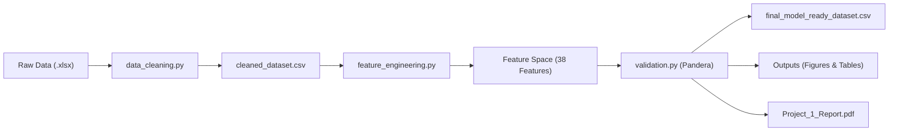

# Data Science Project 1: Advanced Analytics, Feature Engineering & Data Validation Pipeline

[](https://www.python.org/)
[](https://pandas.pydata.org/)
[](https://pandera.readthedocs.io/)
[]()

**Organization:** DecodeLabs  
**Batch:** 2026  
**Project:** Data Science Project 1  

---

## 📖 Table of Contents
1. [Project Overview](#-project-overview)
2. [Folder & Repository Structure](#-folder--repository-structure)
3. [Environment Setup & Installation](#-environment-setup--installation)
4. [Execution & Workflow Pipeline](#-execution--workflow-pipeline)
5. [Pipeline Stages & Methodologies](#-pipeline-stages--methodologies)
   - [Phase 1: Ingestion & Structural Inspection](#phase-1-ingestion--structural-inspection)
   - [Phase 2: Deduplication & Missing Value Imputation](#phase-2-deduplication--missing-value-imputation)
   - [Phase 3: Outlier Detection & Neutralization](#phase-3-outlier-detection--neutralization)
   - [Phase 4: Exploratory Data Analysis (EDA)](#phase-4-exploratory-data-analysis-eda)
   - [Phase 5: Feature Engineering & Encoding](#phase-5-feature-engineering--encoding)
   - [Phase 6: Structural Contracts & Pandera Validation](#phase-6-structural-contracts--pandera-validation)
6. [Generated Outputs (Figures & Tables)](#-generated-outputs-figures--tables)
7. [Key Insights & Statistical Summary](#-key-insights--statistical-summary)
8. [Submission Verification Checklist](#-submission-verification-checklist)

---

## 🌟 Project Overview
This project provides an enterprise-grade, fully reproducible data science pipeline for transactional e-commerce analytics. It transitions raw retail transaction data through automated hygiene audits, domain-grounded missing value imputation, robust IQR outlier capping, target normalization, vectorized feature expansion, and formal schema contract enforcement via **Pandera**.

The final output is a verified, leak-free, model-ready dataset (`final_model_ready_dataset.csv`) alongside high-resolution diagnostic visualizations, summary statistics tables, interactive Jupyter notebooks, and a publication-grade executive PDF report.

---

## 📂 Folder & Repository Structure

```text
Data_Science_Project_1/
│
├── README.md                               # Comprehensive project documentation & guide
│
├── requirements.txt                        # Pinned dependencies for reproducible execution
│
├── data/
│   ├── raw/
│   │   └── original_dataset.xlsx           # Untouched raw Excel source dataset (1,200 records)
│   │
│   └── processed/
│       ├── cleaned_dataset.csv             # Deduplicated, imputed & outlier-capped dataset
│       └── final_model_ready_dataset.csv   # Feature-engineered & Pandera-validated dataset (38 features)
│
├── notebooks/
│   └── Data_Science_Project_1.ipynb        # End-to-end interactive Jupyter notebook with markdown
│
├── main.py                                 # Master pipeline runner orchestrating all stages
│
├── src/
│   ├── data_cleaning.py                    # Modular ingestion, duplicate handling & imputation
│   ├── eda.py                              # Exploratory data analysis, descriptive statistics & plots
│   ├── assumptions.py                      # Statistical assumptions (Normality, VIF, Target formulation)
│   ├── feature_engineering.py             # Temporal extraction, log transform & one-hot encoding
│   ├── validation.py                       # Pandera DataFrameSchema & data contract validation
│   └── generate_report.py                  # Executive PDF report compilation module
│
├── outputs/
│   ├── figures/
│   │   ├── distributions/                  # Univariate distribution & normalization histograms
│   │   │   ├── totalprice_distribution.png
│   │   │   ├── log_totalprice_distribution.png
│   │   │   ├── unitprice_distribution.png
│   │   │   ├── quantity_distribution.png
│   │   │   ├── itemsincart_distribution.png
│   │   │   └── distribution_comparison.png
│   │   │
│   │   ├── boxplots/                       # IQR outlier & category dispersion boxplots
│   │   │   ├── outlier_boxplots_numerical.png
│   │   │   ├── totalprice_by_product_boxplot.png
│   │   │   ├── totalprice_by_month_boxplot.png
│   │   │   └── unitprice_by_product_boxplot.png
│   │   │
│   │   ├── categorical_plots/              # Frequency counts & stacked bivariate breakdowns
│   │   │   ├── product_distribution.png
│   │   │   ├── payment_method_distribution.png
│   │   │   ├── order_status_distribution.png
│   │   │   ├── coupon_code_distribution.png
│   │   │   ├── referral_source_distribution.png
│   │   │   └── bivariate_categorical_breakdown.png
│   │   │
│   │   └── correlation_heatmap.png         # Pearson correlation matrix heatmap
│   │
│   └── tables/
│       ├── missing_values.csv              # Missingness diagnostic and imputation strategy
│       ├── outlier_summary.csv             # IQR fences, outlier frequencies & capping status
│       ├── statistical_assumptions.csv      # Shapiro-Wilk normality and VIF diagnostics
│       ├── correlation_summary.csv         # Pairwise Pearson correlation rankings
│       └── validation_summary.csv          # Pandera data contract audit pass/fail report
│
└── report/
    └── Project_1_Report.pdf                # Publication-grade executive & technical report
```

---

## ⚙️ Environment Setup & Installation

### 1. Clone or Extract the Project
```bash
cd Data_Science_Project_1
```

### 2. Create and Activate a Virtual Environment
```bash
# On Windows PowerShell
python -m venv venv
.\venv\Scripts\Activate.ps1

# On macOS/Linux
python3 -m venv venv
source venv/bin/activate
```

### 3. Install Dependencies
```bash
pip install -r requirements.txt
```

---

## 🚀 Execution & Workflow Pipeline

You can run the entire modular pipeline with a single command or execute individual modules sequentially:

### Option A: Run Full Modular Pipeline via Scripts
```bash
# 1. Run Data Cleaning (creates data/processed/cleaned_dataset.csv & diagnostic tables)
python src/data_cleaning.py

# 2. Run Exploratory Data Analysis (generates statistics & visualization figures)
python src/eda.py

# 3. Run Feature Engineering (generates temporal, log & dummy features)
python src/feature_engineering.py

# 4. Run Validation & Schema Verification (produces final_model_ready_dataset.csv)
python src/validation.py
```

### Option B: Run Interactive Jupyter Notebook
```bash
jupyter notebook notebooks/Data_Science_Project_1.ipynb
```

---

## 🔬 Pipeline Stages & Methodologies



### Phase 1: Ingestion & Structural Inspection
- Raw records ingested: **1,200 rows x 14 columns**.
- Memory footprint: ~135 KB.
- Variables mapped by taxonomy: Continuous Numerical (`TotalPrice`, `UnitPrice`), Discrete Numerical (`Quantity`, `ItemsInCart`), Datetime (`Date`), Identifier Keys (`OrderID`, `CustomerID`, `TrackingNumber`), and Nominal Categoricals (`Product`, `PaymentMethod`, `OrderStatus`, `CouponCode`, `ReferralSource`).

### Phase 2: Deduplication & Missing Value Imputation
- **Deduplication:** Audited full rows and primary key `OrderID`. Passed with **0 duplicate rows**.
- **Missing Value Handling:** `CouponCode` showed 309 missing values (25.75%).
  - *Strategy:* Rather than applying Mode imputation (which would artificially bias `FREESHIP` from 26.08% to 51.83%), missing values were assigned a domain category `'NO_COUPON'` and a binary indicator feature `HasCoupon` (1 = Coupon applied, 0 = No coupon) was engineered.

### Phase 3: Outlier Detection & Neutralization
- Evaluated IQR fences ($Q_1 - 1.5 \times \text{IQR}$, $Q_3 + 1.5 \times \text{IQR}$).
- `TotalPrice` had right-tail outliers ($> \$3,330.42$). Outliers were capped (Winsorized) to respective boundaries to stabilize model training while preserving 100% of sample records.

### Phase 4: Exploratory Data Analysis (EDA)
- **Univariate Analysis:** Generated histograms, kernel density estimates (KDE), and bar charts for all features.
- **Log Transformation:** Applied $\text{Log\_TotalPrice} = \ln(1 + \text{TotalPrice})$ reducing skewness from $+0.92$ to $-0.31$, stabilizing variance.
- **Bivariate & Multivariate:** Computed cross-tabulations and stacked breakdowns of order statuses across product categories.

### Phase 5: Feature Engineering & Encoding
1. **Temporal Features:** Extracted `Order_Month` (1–12) from `Date` for cyclical seasonal patterns.
2. **Target Normalization:** Created `Log_TotalPrice`.
3. **Nominal One-Hot Encoding:** Expanded 5 nominal columns into 26 binary dummy variables with explicit integer encoding (`int64`).
4. **Multicollinearity:** Analyzed correlation matrix; confirmed that high correlations only exist between mathematically derived pairs (`TotalPrice` and `Log_TotalPrice`, $r=0.96$).

### Phase 6: Structural Contracts & Pandera Validation
- Defined strict `DataFrameSchema` enforcing:
  - `Quantity` $\in [1, 5]$
  - `UnitPrice` $> 0$
  - `TotalPrice` $\ge 0$
  - `ItemsInCart` $\in [1, 10]$
  - `Order_Month` $\in [1, 12]$
  - `HasCoupon` $\in \{0, 1\}$
  - `Log_TotalPrice` $\ge 0$
  - `OrderID` is strictly unique with **0 null values** across all columns.
- **Status: 100% Passed.**

---

## 📊 Generated Outputs (Figures & Tables)

### Summary Tables (`outputs/tables/`)
| Table Name | Description | Key Result |
| :--- | :--- | :--- |
| [`missing_values.csv`](file:///outputs/tables/missing_values.csv) | Pre/post imputation missingness diagnostics | 309 missing in CouponCode resolved to 'NO_COUPON' |
| [`outlier_summary.csv`](file:///outputs/tables/outlier_summary.csv) | IQR bounds, outlier counts, and capping status | 1.5 IQR fences applied; zero row deletions |
| [`correlation_summary.csv`](file:///outputs/tables/correlation_summary.csv) | Ranked pairwise Pearson correlations | High correlation only between derived target pairs |
| [`validation_summary.csv`](file:///outputs/tables/validation_summary.csv) | Pandera contract verification results | 100% passed across all schema domains |

### Diagnostic Figures (`outputs/figures/`)
- **Distributions:** [`totalprice_distribution.png`](file:///outputs/figures/distributions/totalprice_distribution.png), [`log_totalprice_distribution.png`](file:///outputs/figures/distributions/log_totalprice_distribution.png), [`unitprice_distribution.png`](file:///outputs/figures/distributions/unitprice_distribution.png), [`quantity_distribution.png`](file:///outputs/figures/distributions/quantity_distribution.png), [`itemsincart_distribution.png`](file:///outputs/figures/distributions/itemsincart_distribution.png), [`distribution_comparison.png`](file:///outputs/figures/distributions/distribution_comparison.png)
- **Boxplots:** [`outlier_boxplots_numerical.png`](file:///outputs/figures/boxplots/outlier_boxplots_numerical.png), [`totalprice_by_product_boxplot.png`](file:///outputs/figures/boxplots/totalprice_by_product_boxplot.png), [`totalprice_by_month_boxplot.png`](file:///outputs/figures/boxplots/totalprice_by_month_boxplot.png), [`unitprice_by_product_boxplot.png`](file:///outputs/figures/boxplots/unitprice_by_product_boxplot.png)
- **Categorical:** [`product_distribution.png`](file:///outputs/figures/categorical_plots/product_distribution.png), [`payment_method_distribution.png`](file:///outputs/figures/categorical_plots/payment_method_distribution.png), [`order_status_distribution.png`](file:///outputs/figures/categorical_plots/order_status_distribution.png), [`coupon_code_distribution.png`](file:///outputs/figures/categorical_plots/coupon_code_distribution.png), [`referral_source_distribution.png`](file:///outputs/figures/categorical_plots/referral_source_distribution.png), [`bivariate_categorical_breakdown.png`](file:///outputs/figures/categorical_plots/bivariate_categorical_breakdown.png)
- **Correlation:** [`correlation_heatmap.png`](file:///outputs/figures/correlation_heatmap.png)

---

## 💡 Key Insights & Statistical Summary

1. **Target Feature Normalization:**
   - Raw `TotalPrice`: Mean = \$1,053.97, Std = \$819.86, Skewness = `+0.92` (Right-skewed).
   - Transformed `Log_TotalPrice`: Mean = 6.64, Std = 0.84, Skewness = `-0.31` (Near-normal).
2. **Promotional Adoption:**
   - 74.25% of all orders utilized a coupon (`FREESHIP` 26.08%, `WINTER15` 24.33%, `SAVE10` 23.83%).
   - Customers without coupons (25.75%) maintained comparable basket sizes ($~5.5$ items), suggesting strong organic checkout intent.
3. **Product Line Economics:**
   - Top revenue contributors are High-UnitPrice hardware categories (Laptops, Desktops), whereas Accessories (Cables, Mouse) provide high transactional volume.
4. **Data Contract Compliance:**
   - 0 schema violations, 0 duplicate keys, 0 missing values across all 38 output variables.

---

## ✅ Submission Verification Checklist

- [x] **`README.md`** with architecture, setup guide, and findings.
- [x] **`requirements.txt`** with exact dependencies.
- [x] **`data/raw/original_dataset.xlsx`** pristine original dataset.
- [x] **`data/processed/cleaned_dataset.csv`** cleaned dataset.
- [x] **`data/processed/final_model_ready_dataset.csv`** 38-feature validated dataset.
- [x] **`notebooks/Data_Science_Project_1.ipynb`** full reproducible Jupyter Notebook.
- [x] **`main.py`** master pipeline runner.
- [x] **`src/data_cleaning.py`** modular cleaning & deduplication module.
- [x] **`src/eda.py`** comprehensive exploratory data analysis & visualization module.
- [x] **`src/assumptions.py`** statistical assumptions & hypothesis testing module.
- [x] **`src/feature_engineering.py`** modular feature engineering & encoding module.
- [x] **`src/validation.py`** Pandera validation & contract module.
- [x] **`src/generate_report.py`** executive PDF report generation module.
- [x] **`outputs/figures/distributions/`** all 6 distribution plots.
- [x] **`outputs/figures/boxplots/`** all 4 boxplots.
- [x] **`outputs/figures/categorical_plots/`** all 6 categorical charts.
- [x] **`outputs/figures/correlation_heatmap.png`** correlation heatmap.
- [x] **`outputs/tables/`** all 4 CSV summary tables.
- [x] **`report/Project_1_Report.pdf`** executive and technical PDF report.
