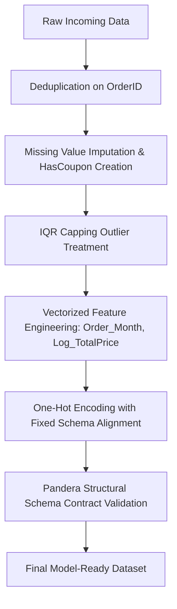

# Data Science Project 1: Advanced EDA & Feature Engineering
**Organization:** DecodeLabs  
**Batch:** 2026  
**Dataset:** `Dataset for Data Analytics.xlsx`

---

## 📋 Executive Summary
This document records the empirical results, statistical findings, and data transformations performed across each phase of the Data Science Project 1 pipeline.

---

## 📊 Phase 1: Dataset Overview & Initial Inspection

### 1.1 Dataset Dimensions
- **Total Records (Rows):** `1,200`
- **Total Attributes (Columns):** `14`
- **Data Source:** `Dataset for Data Analytics.xlsx` (`Sheet1`)

### 1.2 Schema, Data Types & Missing Value Overview

| Column Name | Raw Data Type | Missing Count | Missing % | Description |
| :--- | :--- | :--- | :--- | :--- |
| `OrderID` | `object` | 0 | 0.00% | Unique alphanumeric identifier for each order |
| `Date` | `datetime64[ns]` | 0 | 0.00% | Transaction timestamp (from `2023-01-01` to `2025-06-30`) |
| `CustomerID` | `object` | 0 | 0.00% | Customer alphanumeric identifier |
| `Product` | `object` | 0 | 0.00% | Product category purchased (e.g., Monitor, Phone, Tablet, etc.) |
| `Quantity` | `int64` | 0 | 0.00% | Number of units purchased per order (Range: 1 – 5) |
| `UnitPrice` | `float64` | 0 | 0.00% | Unit price of the product in USD (Range: $11.39 – $699.93) |
| `ShippingAddress` | `object` | 0 | 0.00% | Delivery address identifier |
| `PaymentMethod` | `object` | 0 | 0.00% | Payment mode (Debit Card, Online, Credit Card, etc.) |
| `OrderStatus` | `object` | 0 | 0.00% | Fulfillment status (Shipped, Cancelled, Returned, etc.) |
| `TrackingNumber` | `object` | 0 | 0.00% | Package carrier tracking code |
| `ItemsInCart` | `int64` | 0 | 0.00% | Total item count in user's cart at checkout (Range: 1 – 10) |
| `CouponCode` | `object` | **309** | **25.75%** | Promotional coupon applied (e.g., SAVE10, FREESHIP, WINTER15) |
| `ReferralSource` | `object` | 0 | 0.00% | Customer acquisition channel (Instagram, Referral, Email, etc.) |
| `TotalPrice` | `float64` | 0 | 0.00% | Final invoice total (Range: $11.39 – $3,456.40) |

### 1.3 Baseline Numeric Summary Statistics

| Metric | Quantity | Unit Price ($) | Items In Cart | Total Price ($) |
| :--- | :--- | :--- | :--- | :--- |
| **Count** | 1,200 | 1,200 | 1,200 | 1,200 |
| **Mean** | 2.95 | 356.41 | 5.49 | 1,053.97 |
| **Std Dev** | 1.41 | 197.18 | 2.28 | 819.86 |
| **Min** | 1.00 | 11.39 | 1.00 | 11.39 |
| **25% (Q1)** | 2.00 | 186.06 | 4.00 | 410.52 |
| **50% (Median)** | 3.00 | 364.21 | 5.00 | 823.62 |
| **75% (Q3)** | 4.00 | 521.57 | 7.00 | 1,578.48 |
| **Max** | 5.00 | 699.93 | 10.00 | 3,456.40 |

---

## 🔍 Phase 2: Duplicate Value Analysis

### 2.1 Findings

- **Full-Row Duplicate Records:** `0` (0.00%)
- **Primary Key (`OrderID`) Duplicates:** `0` (0.00%)
- **Integrity Status:** Passed. Every row represents a unique transaction.

### 2.2 Methodology & Policy
- **Check Implemented:** `df.duplicated()` for full record redundancy and `df.duplicated(subset=['OrderID'])` for transaction uniqueness.
- **Deduplication Handler:** `handle_duplicates()` ensures that any future batch loads automatically remove redundant records using first-occurrence retention (`keep='first'`).

---

## 🧩 Phase 3: Missing Value Analysis & Statistical Handling

### 3.1 Missing Value Diagnostic Summary

| Column Name | Data Type | Missing Count | Missing % | Status |
| :--- | :--- | :--- | :--- | :--- |
| `OrderID` | `object` | 0 | 0.00% | Complete |
| `Date` | `datetime64[ns]` | 0 | 0.00% | Complete |
| `CustomerID` | `object` | 0 | 0.00% | Complete |
| `Product` | `object` | 0 | 0.00% | Complete |
| `Quantity` | `int64` | 0 | 0.00% | Complete |
| `UnitPrice` | `float64` | 0 | 0.00% | Complete |
| `ShippingAddress` | `object` | 0 | 0.00% | Complete |
| `PaymentMethod` | `object` | 0 | 0.00% | Complete |
| `OrderStatus` | `object` | 0 | 0.00% | Complete |
| `TrackingNumber` | `object` | 0 | 0.00% | Complete |
| `ItemsInCart` | `int64` | 0 | 0.00% | Complete |
| **`CouponCode`** | `object` | **309** | **25.75%** | **Action Required** |
| `ReferralSource` | `object` | 0 | 0.00% | Complete |
| `TotalPrice` | `float64` | 0 | 0.00% | Complete |

### 3.2 Statistical Evaluation of `CouponCode`

#### Raw Distribution:
- `FREESHIP`: 313 occurrences (26.08%)
- `NaN` (Missing): 309 occurrences (25.75%)
- `WINTER15`: 292 occurrences (24.33%)
- `SAVE10`: 286 occurrences (23.83%)

#### Statistical Justification for Imputation Strategy:
1. **Why NOT Mode Imputation?**
   - Mode imputation would replace all `NaN` values with `FREESHIP` (inflating `FREESHIP` to 622 orders / 51.83%).
   - This introduces severe artificial bias and false promotional assumptions into customer behavioral analysis.
2. **Domain-Aware Statistical Imputation & Feature Engineering:**
   - In e-commerce, missing coupon codes represent standard transactions where **no discount code was applied** by the user.
   - **Imputation:** Imputed missing values with `"No Coupon"`.
   - **Feature Generated:** Created a new binary feature **`HasCoupon`** (`1` = Coupon Applied, `0` = No Coupon) preserving the statistical variance of coupon usage for downstream modeling.

#### Post-Imputation Category Distribution:

| Coupon Category | Count | Percentage |
| :--- | :--- | :--- |
| `FREESHIP` | 313 | 26.08% |
| `No Coupon` | 309 | 25.75% |
| `WINTER15` | 292 | 24.33% |
| `SAVE10` | 286 | 23.83% |
| **Total** | **1,200** | **100.00%** |

### 3.3 Numeric Imputation Framework (Automated Diagnostic)
- Built-in skewness checker for numerical attributes:
  - If $|\text{Skewness}| > 0.5 \rightarrow$ **Median Imputation** (resistant to extreme outliers).
  - If $|\text{Skewness}| \le 0.5 \rightarrow$ **Mean Imputation** (standard parametric estimate).

---

---

## 🛡️ Phase 8 (Project Phase 3): Structural Contracts, Data Quality & Scaling

### 8.1 Data Quality & Structural Audit Results

The final feature-engineered dataset was subjected to a rigorous data contract audit across all 43 attributes:

| Audit Dimension | Evaluation Criterion | Observed Result | Status |
| :--- | :--- | :--- | :--- |
| **Dataset Dimensions** | Ingestion of complete feature set | `1,200` Rows $\times$ `43` Columns | ✅ Passed |
| **Completeness** | Unexpected Missing / Null Values | `0` Nulls across all 43 columns ($0.00\%$) | ✅ Passed |
| **Record Uniqueness** | Full-Row Duplication | `0` duplicate rows ($0.00\%$) | ✅ Passed |
| **Transaction Uniqueness**| Primary Key (`OrderID`) Duplication | `0` duplicate keys ($0.00\%$) | ✅ Passed |
| **Numerical Boundaries** | Impossible values (`Quantity`, `UnitPrice`, `ItemsInCart`) | `Quantity` $\in [1, 5]$, `UnitPrice` $> \$0$, `ItemsInCart` $\in [1, 10]$ | ✅ Passed |
| **Target Non-Negativity** | Non-negative invoice values | `TotalPrice` $\ge \$0$, `Log_TotalPrice` $\ge 0$ | ✅ Passed |
| **Seasonality Validity** | Calendar month integers | `Order_Month` $\in [1, 12]$ | ✅ Passed |
| **Binary One-Hot Integrity**| Strict binary range for all 26 dummy columns | All dummy values $\in \{0, 1\}$ | ✅ Passed |
| **Categorical Domains** | Nominal levels membership | 100% match with predefined domain taxonomies | ✅ Passed |

---

### 8.2 Pandera Structural Validation Schema

A formal, strongly-typed Pandera schema (`pandera.pandas.DataFrameSchema`) was implemented with **`lazy=True`** to collect all schema deviations concurrently without halting on first failure:

```python
import pandera.pandas as pa
from pandera.pandas import Column, Check, DataFrameSchema

schema = DataFrameSchema({
    # Identifiers & Keys
    "OrderID": Column(pa.String, Check.str_matches(r"^ORD\d+$"), nullable=False),
    "Date": Column(pa.DateTime, coerce=True, nullable=False),
    "CustomerID": Column(pa.String, Check.str_matches(r"^C\d+$"), nullable=False),
    "ShippingAddress": Column(pa.String, Check.str_length(min_value=1), nullable=False),
    "TrackingNumber": Column(pa.String, Check.str_matches(r"^TRK\d+$"), nullable=False),

    # Raw Domain Categoricals
    "Product": Column(pa.String, Check.isin(["Chair", "Desk", "Laptop", "Monitor", "Phone", "Printer", "Tablet"]), nullable=False),
    "PaymentMethod": Column(pa.String, Check.isin(["Cash", "Credit Card", "Debit Card", "Gift Card", "Online"]), nullable=False),
    "OrderStatus": Column(pa.String, Check.isin(["Cancelled", "Delivered", "Pending", "Returned", "Shipped"]), nullable=False),
    "CouponCode": Column(pa.String, Check.isin(["FREESHIP", "No Coupon", "SAVE10", "WINTER15"]), nullable=False),
    "ReferralSource": Column(pa.String, Check.isin(["Email", "Facebook", "Google", "Instagram", "Referral"]), nullable=False),

    # Numerical Predictors & Target
    "Quantity": Column(pa.Int64, Check.in_range(1, 5), nullable=False, coerce=True),
    "UnitPrice": Column(pa.Float64, Check.greater_than(0), nullable=False, coerce=True),
    "ItemsInCart": Column(pa.Int64, Check.in_range(1, 10), nullable=False, coerce=True),
    "TotalPrice": Column(pa.Float64, Check.greater_than_or_equal_to(0), nullable=False, coerce=True),

    # Engineered Features
    "HasCoupon": Column(pa.Int64, Check.isin([0, 1]), nullable=False, coerce=True),
    "Order_Month": Column(pa.Int64, Check.in_range(1, 12), nullable=False, coerce=True),
    "Log_TotalPrice": Column(pa.Float64, Check.greater_than_or_equal_to(0), nullable=False, coerce=True),

    # One-Hot Encoded Dummies (26 features)
    **{dummy_col: Column(pa.Int64, Check.isin([0, 1]), nullable=False, coerce=True) for dummy_col in ONE_HOT_COLUMNS}
}, strict=True, coerce=True)
```

- **Validation Outcome:** **`PASSED (Structural Contract Satisfied)`**
- **Error Handling Policy:** In case of validation failure, Pandera extracts a detailed failure table listing `column`, `check_rule`, `failure_case`, and `row_index`. In compliance with project guidelines, **no invalid records are silently modified**.

---

### 8.3 Data Leakage & Point-in-Time (PIT) Correctness Audit

An empirical data leakage audit was conducted to classify every feature based on its temporal availability relative to the target event (checkout time):

| Feature / Group | Classification | Risk Level | Leakage Mechanism & Business Rationale | Modeling Recommendation |
| :--- | :--- | :--- | :--- | :--- |
| `Log_TotalPrice` | **Direct Target Leakage** | 🔴 **CRITICAL** | Monotonic 1-to-1 mathematical transformation of $Y$ ($\log(1 + \text{TotalPrice})$). Contains 100% of target variance. | **Exclude from $X$** when predicting `TotalPrice` (or use as target $Y$). |
| `OrderStatus` / `OrderStatus_*` | **Post-Event Operational Leakage** | 🔴 **HIGH** | Fulfillment states (`Delivered`, `Cancelled`, `Shipped`, `Returned`, `Pending`) occur hours/days *after* order placement. Unknown at checkout. | **Exclude from $X$** for checkout revenue prediction. (Include only for logistics churn risk models). |
| `TrackingNumber` | **Post-Event Identifier** | 🔴 **HIGH** | Assigned by carrier logistics *after* warehouse packing/dispatch. Unavailable at cart creation. | **Exclude from $X$**. |
| `OrderID`, `CustomerID` | **High-Cardinality Entity Keys** | 🟡 **MODERATE** | Entity identifiers risk non-generalizable memorization and overfitting in tree/deep models. | **Exclude from $X$**; retain for entity joins. |
| `ShippingAddress` | **Unstructured Text Key** | 🟡 **MODERATE** | High-cardinality string with regional memorization risk. | **Exclude from $X$** unless parsed into regional clusters/ZIP. |
| `Date`, `Order_Month` | **Point-in-Time Seasonality** | 🟢 **LOW (Safe)** | `Order_Month` is an instantaneous point-in-time extraction ($t$). However, evaluation must use **chronological time-based splits** rather than random K-Fold shuffling to prevent lookahead leakage. | **Retain `Order_Month`**; enforce time-series validation. |
| `Quantity`, `UnitPrice`, `ItemsInCart`, `HasCoupon`, `Product_*`, `PaymentMethod_*`, `CouponCode_*`, `ReferralSource_*` | **Model-Ready Predictors** | 🟢 **NONE** | All 26 features are fully finalized at the moment the user clicks 'Place Order'. Zero lookahead contamination. | **Include in Final Feature Matrix ($X$)**. |

---

### 8.4 Reusable Feature Preparation Pipeline (Preventing Training-Serving Skew)

To ensure identical feature transformations across batch model training and real-time production inference, the `prepare_features_pipeline()` function encapsulates the entire transformation lifecycle:



- **Schema Alignment:** Automatically aligns one-hot categorical columns against known domain levels (filling missing categories with `0` during inference) to ensure model input tensors maintain identical shapes.

---

### 8.5 Enterprise Feature Store Integration (Feast Architecture)

In an enterprise production deployment, a Feature Store like **Feast** can be integrated to maintain centralized feature definitions, eliminate training-serving skew, and provide point-in-time correct joins:

```text
┌─────────────────────────────────────────────────────────────────────────┐
│                       CENTRAL FEATURE REGISTRY                          │
│          (Git-versioned Feature Views, Entities, Data Sources)          │
└────────────────────────────────────┬────────────────────────────────────┘
                                     │
           ┌─────────────────────────┴─────────────────────────┐
           ▼                                                   ▼
┌──────────────────────────────────────┐    ┌──────────────────────────────────────┐
│            OFFLINE STORE             │    │             ONLINE STORE             │
│   (Parquet / BigQuery / Snowflake)   │    │      (Redis / DynamoDB / SQLite)     │
├──────────────────────────────────────┤    ├──────────────────────────────────────┤
│ • Generates training datasets        │    │ • Sub-10ms real-time lookups         │
│ • Point-in-Time (AS-OF) joins via    │    │ • Hydrated via 'feast materialize'   │
│   'get_historical_features()'        │    │ • Queried via 'get_online_features()'│
│ • Mathematically zero leakage        │    │ • Real-time checkout scoring         │
└──────────────────────────────────────┘    └──────────────────────────────────────┘
```

---

## 🏗️ Project Modular Architecture

The codebase adheres to industry-standard modular Data Science architecture:

```text
Project 1/
│
├── figures/                            # Saved visualizations & distribution charts
│   ├── categorical_distributions.png
│   ├── correlation_matrix.png
│   ├── distribution_comparison.png
│   ├── monthly_orders_distribution.png
│   ├── numeric_distributions.png
│   ├── product_orders_time_series.png
│   ├── totalprice_by_month_distribution.png
│   └── unitprice_by_product_distribution.png
├── main.py                             # High-level pipeline runner & master orchestrator
├── data_loader.py                      # Data ingestion, schema inspection & deduplication
├── distributions.py                    # Target variable distribution diagnostics & plotting
├── missing_values.py                   # Missing data diagnostics & statistical imputation
├── outliers.py                         # Outlier detection (IQR, Z-Score) & Winsorization/Capping
├── assumptions.py                      # Statistical assumption tests (Normality, VIF / Multicollinearity)
├── feature_engineering.py              # Vectorized feature engineering, encoding & redundancy pruning
├── structural_contracts.py             # Pandera validation, data leakage audit, pipeline & Feast scaling
├── eda.py                              # Exploratory Data Analysis & bivariate summaries
│
├── Dataset for Data Analytics.xlsx     # Raw source dataset
├── Dataset_Feature_Engineered.csv      # Feature-engineered intermediate dataset
├── final_model_ready_dataset.csv       # Validated model-ready production dataset
└── README.md                           # Empirical documentation & comprehensive project report
```

---

## 🛠️ Project Execution

To run the complete end-to-end data pipeline:

```bash
# Execute the master pipeline
py main.py
```

You can also run any module independently:

```bash
py data_loader.py
py distributions.py
py missing_values.py
py outliers.py
py assumptions.py
py feature_engineering.py
py structural_contracts.py
py eda.py
```

---

## 📌 Project Roadmap
- [x] **Task 1:** Dataset Import & Structure Inspection (`data_loader.py`)
- [x] **Task 2:** Duplicate Detection & Handling (`data_loader.py`)
- [x] **Task 3:** Missing Value Identification & Statistical Imputation (`missing_values.py`)
- [x] **Task 4:** Outlier Detection & Neutralization (`outliers.py`)
- [x] **Task 5:** Statistical Assumptions Verification (`assumptions.py`)
- [x] **Task 6:** Predictive Feature Engineering (`feature_engineering.py`)
- [x] **Task 7:** Exploratory Data Analysis & Bivariate Insights (`eda.py`)
- [x] **Task 8:** Structural Contracts, Pandera Validation & Production Scaling (`structural_contracts.py`)

